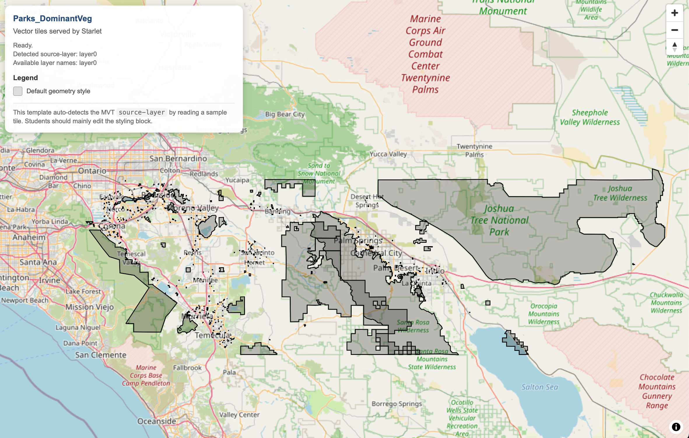
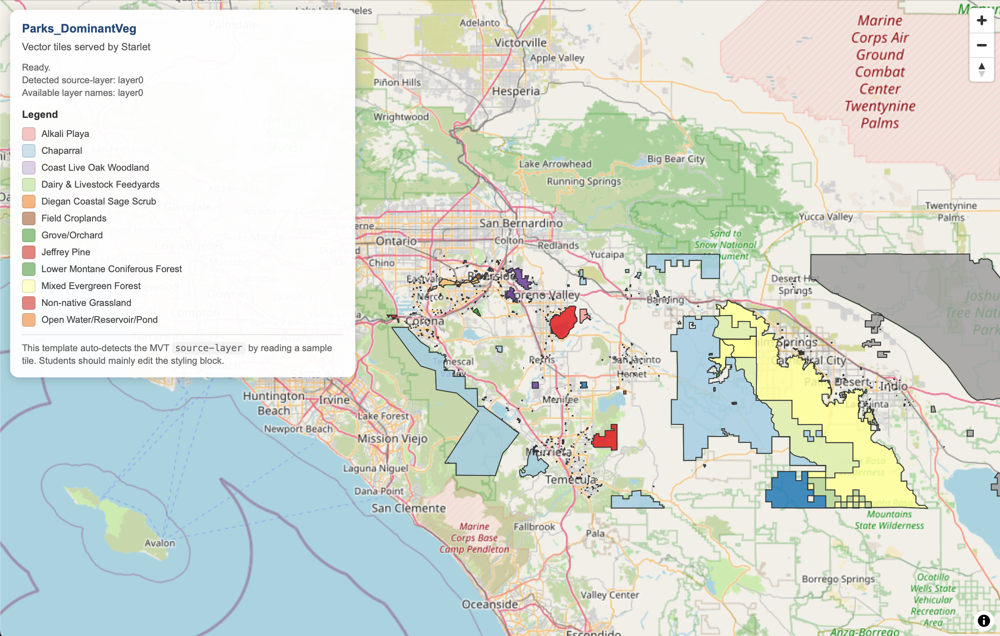

# Starlet Workshop — Example

This project demonstrates a minimal pipeline for:

1. Preparing geospatial data  
2. Building vector tiles with Starlet  
3. Serving and visualizing them in a browser  

Everything runs using **just Python scripts** — no Jupyter notebook required.

---

## Requirements

- Python 3.10+  
- Install dependencies:

```bash
pip install starlet
```

- Access to a free LLM (we assume Gemini for this workshop)

---

## Step 1 — Dataset Composition and Preparation

To generate a script that combines:
- Riverside_Parks.geojson
- Riverside_VegetationTypes.geojson

Send the prompt in [prompt_data_comp.txt](prompt_data_comp.txt) to your LLM.  
It should return a script similar to [data_comp.py](data_comp.py).

Then run:

```bash
python3 data_comp.py \
  Riverside_Parks.geojson \
  Riverside_VegetationTypes.geojson \
  Riverside_Parks_DominantVegetation.geojson
```

### What this does:
- Computes dominant vegetation per park  
- Outputs a clean GeoJSON  
- Adds a `dominant_vegetation` attribute  

---

## Step 2 — Build Tiles + Serve Map Using Starlet

Run:

```bash
python serve_map.py Riverside_Parks_DominantVegetation.geojson Parks_DominantVeg
```

### This script will:
1. Build a vector tile pyramid using Starlet  
2. Start a local Flask server  
3. Open the map automatically in your browser  

---

## Step 3 — View the Map

The browser will open automatically at:

http://127.0.0.1:8765/

### Example Output



---

## What Happens Internally

### Tile Generation

Starlet builds tiles into:

datasets/<dataset_name>/mvt/{z}/{x}/{y}.mvt

### Server Endpoints

| Endpoint | Purpose |
|--------|--------|
| / | Serves map.html |
| /config.json | Provides dataset + bbox + zoom |
| /datasets/.../*.mvt | Serves vector tiles |

---

## Step 4 — Style the Map

The default map will appear unstyled (gray polygons).

To make it informative:
1. Open [map.html](map/html)
2. Insert styling code into the LLM styling block  
3. Use the prompt in [prompt_styling.txt](prompt_styling.txt) to generate styling  

### Example Styled Output




---

## Example Styling Block (Generated by LLM)

```javascript
const palette = [
  '#1f78b4',
  '#33a02c',
  '#e31a1c',
  '#ff7f00',
  '#6a3d9a',
  '#b15928',
  '#a6cee3',
  '#b2df8a',
  '#fb9a99',
  '#fdbf6f',
  '#cab2d6',
  '#ffff99'
];

const categoryColorMap = new Map();
let thematicMapRef = null;
let thematicSourceIdRef = null;
let thematicSourceLayerRef = null;
let refreshScheduled = false;

function getCategory(properties) {
  const raw = properties?.dominant_vegetation;
  if (raw === null || raw === undefined) return "Unknown";

  const value = String(raw).trim();
  if (!value || /^unknown$/i.test(value) || /^null$/i.test(value) || /^n\/a$/i.test(value)) {
    return "Unknown";
  }
  return value;
}

function getColorForCategory(category) {
  if (category === "Unknown") return "#9e9e9e";

  if (!categoryColorMap.has(category)) {
    categoryColorMap.set(category, palette[categoryColorMap.size % palette.length]);
  }
  return categoryColorMap.get(category);
}

function getOrderedCategories() {
  const categories = Array.from(seenLegendValues);
  const known = categories
    .filter(c => c !== "Unknown")
    .sort((a, b) => a.localeCompare(b));
  return seenLegendValues.has("Unknown") ? [...known, "Unknown"] : known;
}

function updateLegend() {
  const legendEl = document.getElementById("legend");
  if (!legendEl) return;

  const ordered = getOrderedCategories();

  if (ordered.length === 0) {
    legendEl.innerHTML = `
      <h4>Legend</h4>
      <div style="font-size:11px;color:#666;">Waiting for features…</div>
    `;
    return;
  }

  legendEl.innerHTML = `
    <h4>Legend</h4>
    ${ordered.map(category => `
      <div class="legend-row">
        <span class="legend-swatch" style="background:${getColorForCategory(category)}; opacity:0.6;"></span>
        <span>${category}</span>
      </div>
    `).join("")}
  `;
}

function buildFillColorExpression() {
  const ordered = getOrderedCategories();
  const expr = ["match", ["coalesce", ["get", "dominant_vegetation"], "Unknown"]];

  for (const category of ordered) {
    if (category === "Unknown") continue;
    expr.push(category, getColorForCategory(category));
  }

  expr.push("Unknown", "#9e9e9e");
  expr.push("#cccccc");
  return expr;
}

function collectVisibleCategories() {
  if (!thematicMapRef || !thematicMapRef.getLayer("theme-fill")) return false;

  const features = thematicMapRef.queryRenderedFeatures({ layers: ["theme-fill"] });
  let changed = false;

  for (const feature of features) {
    const props = feature.properties || {};
    const category = getCategory(props);
    if (!seenLegendValues.has(category)) {
      seenLegendValues.add(category);
      getColorForCategory(category);
      changed = true;
    }
  }

  return changed;
}

function applyDynamicColors() {
  if (!thematicMapRef || !thematicMapRef.getLayer("theme-fill")) return;

  thematicMapRef.setPaintProperty("theme-fill", "fill-color", buildFillColorExpression());
  updateLegend();
}

function scheduleRefresh() {
  if (refreshScheduled) return;
  refreshScheduled = true;

  requestAnimationFrame(() => {
    refreshScheduled = false;
    const changed = collectVisibleCategories();
    if (changed) {
      applyDynamicColors();
    } else {
      updateLegend();
    }
  });
}

function addThematicLayers(map, sourceId, sourceLayer) {
  thematicMapRef = map;
  thematicSourceIdRef = sourceId;
  thematicSourceLayerRef = sourceLayer;

  if (map.getLayer("theme-outline")) map.removeLayer("theme-outline");
  if (map.getLayer("theme-fill")) map.removeLayer("theme-fill");

  map.addLayer({
    id: "theme-fill",
    type: "fill",
    source: sourceId,
    "source-layer": sourceLayer,
    paint: {
      "fill-color": "#cccccc",
      "fill-opacity": 0.6
    }
  });

  map.addLayer({
    id: "theme-outline",
    type: "line",
    source: sourceId,
    "source-layer": sourceLayer,
    paint: {
      "line-color": "rgba(50,50,50,0.85)",
      "line-width": 1
    }
  });

  map.on("idle", scheduleRefresh);
  map.on("moveend", scheduleRefresh);
  map.on("zoomend", scheduleRefresh);

  scheduleRefresh();
}
```

---

## Common Issues

### Map shows nothing
- Check tiles exist and the path is correct: datasets/<dataset>/mvt/  
- Ensure dataset is not empty  
- Check geometry validity  

---

### Many 404 tile requests
This is normal if:
- Requests fall outside dataset extent  
- Zoom exceeds built level (default: 10)  

---

Feel free to check errors and use LLM for help to resolve possible issues in your code.

