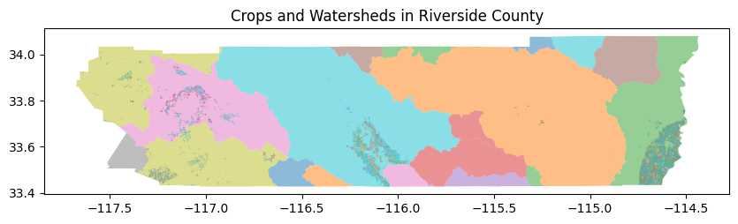

# 🌍 StarMap Workshop Competition  

---

## 🎭 Your Role: Watershed Manager

You are a member of the State and Regional Water Boards who is responsible for protecting Riverside County’s water resources. Your responsibility is to understand and communicate the **agricultural landscape** in Riverside County. Using geospatial data and interactive visualization, you will produce map visualizations that highlights key patterns, insights, and metrics about crop production in the Riverside County watershed areas. You will work in teams of three members and one submission from each team is required.

Note: watershed is an area of land that catches rain and snow, draining all surface water and groundwater into a common outlet, such as a river, lake, or ocean. 

---

## 📊 Datsets

You are given two datasets:
- [**Riverside County Watershed regions**](https://drive.google.com/file/d/1TWvMOM_qTbr_T-xDGsMQuKx9chcCK6gq/view?usp=sharing)
- [**Rierside County Crop Data (with acreage and crop types)**](https://drive.google.com/file/d/10VwiL-vjJ7Uv_QaGhrILHiU8cbybkrG1/view?usp=sharing)

You are expected to combine the datasets to yield meaningful visualization for three challenges.

---

## 🗺️ Deliverables

You will upload a PDF alongside your code / dataset files to this link. Please put everything in a .zip file:
(Competition Results Submission)[https://docs.google.com/forms/d/e/1FAIpQLScHg0d5F9j6L0WpdlSiGmCXcch2hmBlx5ReylPCN7z8x0g3Ng/viewform?usp=publish-editor]
The deadline is 11:40am. In the PDF you will have screenshot(s) of the visualizations you created alongside a description of what we can see on the map. 

**MVT tiles** - Use StarLet package to generate MVT tiles for the datasets to be visualized.

**HTML files** - Create a .html file for each of three tasks:

Task 1. Total Crop Area

Task 2. Crop Diversity

Task 3. Dominant Crops in each watersheds

---

## ✅ Tasks & Scoring

You will be evaluated based on how many tasks you complete **and** how well you execute them.

---

### 🌾 Task 1: Total Crop Area (Gradient Visualization)

**Objective:**  
Show how crop acreage is distributed across the watersheds.

**Requirements:**
- Calculate total acreage per spatial unit (e.g., polygon or aggregated area)
- Use **gradient (continuous) coloring** to represent acreage
- Higher acreage → stronger visual intensity

**What we’re looking for:**
- Clear visual hierarchy
- Appropriate color scale
- Easy-to-understand mapping between color and value

---

### 🌱 Task 2: Crop Diversity (Categorical Visualization)

**Objective:**  
Reveal the diversity of crops in the watersheds.

**Requirements:**
- Use **categorical coloring** to represent different crop types (e.g., `class_name`)
- Include a **legend** that clearly maps colors to crop names

**What we’re looking for:**
- Distinct and readable color categories
- Well-designed legend
- Ability to visually assess diversity at a glance

---

### 🥇 Task 3: Dominant Crops in Watersheds

**Objective:**  
Identify and communicate the **dominant crop type** in each watershed.

**Requirements:**
- Aggregate crop data within each watershed
- Determine the **crop with the highest total acreage** 
- Visually highlight the watersheds based on their dominant crop

**What we’re looking for:**
- Correct aggregation and analysis
- Clear emphasis on the dominant crop
- Strong visual storytelling

---

## 🎨 Design & Interaction Expectations

### Should Have
- Watershed boundary clearly visible
- Clear legends
- Clean, readable layout

### Bonus
- Layer toggles or filters
- Highlighting or focus effects
- Narrative annotations
- Hover interaction (e.g., crop name, acreage)
- Thoughtful color choices

---

## 🏆 Judging Criteria

You will be evaluated based on:

- **Task Completion** – How many required tasks are implemented
- **Technical Accuracy** – Correct use of spatial joins and aggregation
- **Visualization Quality** – Clarity, design, and usability

---

**Good luck, Watershed Manager 🌱**
